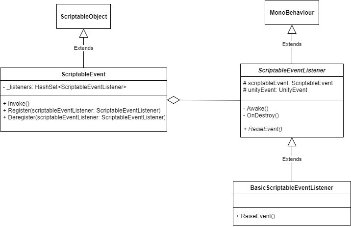

# Scriptable Event System
This system follows a design similar to the “Observer pattern” where the “Subject” is represented as a “Scriptable Object” and the “Observer” is represented as the “Event Listener” MonoBehaviour.

# Diagram

# References
https://www.raywenderlich.com/2826197-scriptableobject-tutorial-getting-started
https://www.youtube.com/watch?v=lgA8KirhLEU 
